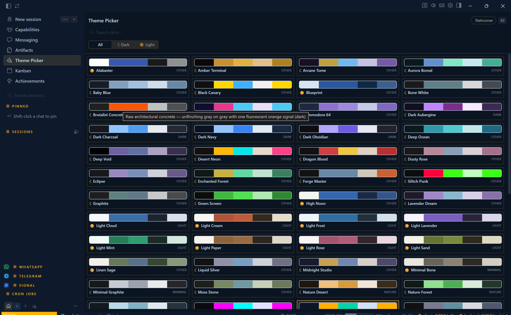

# Hermes Theme Picker

**Current version: v1.5.1** · [See what changed](CHANGELOG.md)

Give Hermes a look that feels like yours. **Hermes Theme Picker** turns the
entire app into a gallery of beautiful, one-click themes, led by Dynamic Themes
that include both light and dark modes. Pick a style and watch it appear
instantly across every device connected to your gateway — including the CLI.



## Highlights

- **Dynamic Themes** — switch one theme between coordinated light and dark
  palettes instead of managing separate skins.
- **Instant, gateway-wide updates** — the current Desktop repaints immediately,
  then every connected Desktop and CLI receives the same palette.
- **A visual gallery** — browse real color swatches, search 104 scenes by name,
  and preview them in light or dark mode.
- **Built for comparison** — change themes without leaving the picker, closing
  your chat, or reloading Hermes.
- **Works offline** — the catalog is embedded in the plugin, and themes are also
  available in **Settings → Appearance** when the gateway is unavailable.
- **Made to stick** — each profile remembers its theme and mode across restarts.

The plugin includes **140 skin palettes**, organized into 57 Dynamic Themes plus
dark-only and light-only scenes. See [Third-Party Notices](THIRD_PARTY_NOTICES.md)
for palette credits.

## Install

### Requirements

- A recent version of **Hermes Desktop**.
- A Hermes **gateway** for synchronization across devices. Without one, the
  current Desktop still applies and saves themes locally.
- **Python 3.8+** and `PyYAML` only if you want to regenerate the catalog. They
  are not required to use the picker.

Clone or download this repository, then install the Desktop plugin on each
computer where you use Hermes Desktop.

### Windows

Double-click `install\install-windows.cmd`, or run:

```powershell
.\install\install-windows.cmd
```

The installer uses `%HERMES_HOME%` when set. Otherwise, it selects an existing
`%LOCALAPPDATA%\hermes` Desktop home and falls back to
`%USERPROFILE%\.hermes`. The exact destination is printed when installation
finishes.

### macOS

Double-click `install/install-macos.command`, or run:

```bash
./install/install-macos.command
```

If macOS blocks the downloaded script, right-click it and choose **Open**, or
run `sh install/install-macos.command`. The installer uses `$HERMES_HOME` when
set and otherwise installs under `~/.hermes`.

### Linux or manual installation

Copy `plugin/plugin.js` to the exact destination for your platform:

| Platform | Destination |
|---|---|
| Windows | `%LOCALAPPDATA%\hermes\desktop-plugins\theme-picker\plugin.js` |
| macOS / Linux | `~/.hermes/desktop-plugins/theme-picker/plugin.js` |

If `HERMES_HOME` is set, use it in place of `%LOCALAPPDATA%\hermes` or
`~/.hermes`.

```bash
hermes_home="${HERMES_HOME:-$HOME/.hermes}"
mkdir -p "$hermes_home/desktop-plugins/theme-picker"
cp plugin/plugin.js "$hermes_home/desktop-plugins/theme-picker/plugin.js"
```

### Enable gateway-wide themes

On the machine running your gateway, install the bundled skins and Dynamic
Theme transport variants:

```bash
./install/install-gateway-skins.sh
```

The installer honors `$HERMES_HOME` and otherwise uses `~/.hermes/skins/`. It
does not require a gateway restart and will not overwrite modified skins unless
you deliberately rerun it with `--force`; destination symlinks are always
refused.

Finally, in Hermes Desktop:

1. Open the Command Palette and run **Reload desktop plugins** (or restart the
   app).
2. Click the current theme in the status bar, select **Theme Picker** in the
   sidebar, or run **Open Theme Picker** from the Command Palette.
3. Pick a theme and choose **Light mode** or **Dark mode**.

## How synchronization works

A selection is applied in two coordinated steps:

1. The plugin repaints the current Desktop in place and saves the selected
   theme and mode for the active profile.
2. It sends the matching light or dark skin to the active gateway, which
   broadcasts the palette to every connected Desktop and CLI.

The local catalog remains available if the gateway is offline. A warning tells
you when only the local Desktop was updated.

You can also set an installed gateway skin directly:

```bash
hermes config set display.skin <theme-name>
```

## Add your own skins

Hermes skins are YAML files containing a name, description, and colors.

- **Try one immediately:** place it in the gateway's `~/.hermes/skins/`
  directory and apply it once. Live discovery adds it to the current picker
  session.
- **Make it part of the catalog:** add it to this repository's `skins/`
  directory, regenerate `plugin.js`, reinstall the plugin, and reload Desktop
  plugins.

### Regenerate the catalog

```bash
# Bundled skins/ → plugin/plugin.js
python3 scripts/regenerate.py

# Read another skin directory
python3 scripts/regenerate.py ~/.hermes/skins

# Choose an output file
python3 scripts/regenerate.py ~/.hermes/skins /tmp/plugin.js
```

On Windows, the included runner combines bundled themes with skins installed in
`%LOCALAPPDATA%\hermes\skins\` and updates the installed plugin:

```powershell
Set-ExecutionPolicy -Scope Process Bypass
.\install\regenerate-windows.ps1
```

If needed, install PyYAML with `py -m pip install --user PyYAML`. The generator
refuses to replace `plugin.js` when no valid skins are found.

For UI changes, edit `plugin/plugin.template.js`, run the generator, then copy
the rebuilt `plugin/plugin.js` into Hermes Desktop and reload plugins.

## Project layout

```text
plugin/                        Desktop plugin and source template
skins/                         Bundled source palettes
gateway-skins/                 Mode-locked gateway transport palettes
scripts/regenerate.py          Catalog generator
install/                       Desktop and gateway installers
docs/ARCHITECTURE.md           Implementation details
THIRD_PARTY_NOTICES.md         Licenses for bundled palettes
```

## Uninstall

Delete the `theme-picker` directory from the local `desktop-plugins` folder,
then reload Desktop plugins or restart Hermes. Your skin files are not removed.

## Credits

The picker is an original implementation and bundles MIT-licensed palettes
from:

- [BChop's Hermes Skins Pack](https://github.com/bchop-studio/hermes-skins-pack)
- [CliffWade's Hermes Desktop Theme Pack](https://github.com/CliffWade/hermes-desktop-theme-pack),
  whose theme-switcher concept also inspired this project

Full copyright and license text is available in
[THIRD_PARTY_NOTICES.md](THIRD_PARTY_NOTICES.md).

## License

MIT — see [LICENSE](LICENSE).